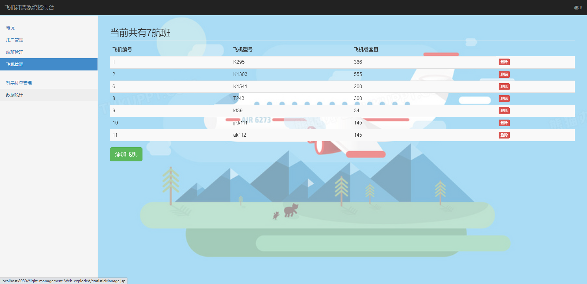

## 基于JSP+Servlet实现的民航售票管理系统(程序+报告)

- <b>完整代码获取地址：从戎源码网 ([https://armycodes.com/](https://armycodes.com/))</b>
- <b>技术探讨、资料分享，请加QQ群：692619798</b> 
- <b>作者微信：19941326836  QQ：952045282</b> 
- <b>承接计算机毕业设计、Java毕业设计、Python毕业设计、深度学习、机器学习</b>
- <b>选题+开题报告+任务书+程序定制+安装调试+论文+答辩ppt 一条龙服务</b>
- <b>所有选题地址 ([https://github.com/YuLin-Coder/AllProjectCatalog](https://github.com/YuLin-Coder/AllProjectCatalog)) </b>

## 项目介绍
基于JSP+Servlet实现的民航售票管理系统，主要功能如下

【管理员】
1. 概况：
- 显示系统的当前状态和概要信息

2. 用户管理：
-修改还用户身份证号码及昵称

3. 航班管理： 
- 添加、编辑和删除航班信息，包括起飞时间、飞机编号、机票价格等。
   
- 可以查询和显示航班列表，以及根据起飞地、目的地和起飞时间等条件进行筛选。

4. 飞机管理：
   - 添加、编辑和删除飞机信息，包括飞机号、机型、座位数等。
   - 可以查询和显示飞机列表，以及根据飞机号和机型等条件进行筛选。

5. 订单管理：
   - 查看订单信息，包括订单号、用户名、航班信息、票价等。
   - 可以查询和显示订单列表，以及根据订单号、订票人姓名和航班信息进行筛选。
 
6. 数据统计：
   - 统计和显示系统的各项数据，如航班数量、飞机数量、订单数量、销售额等。
   - 可以按时间段进行统计，以及按航班、飞机和用户等进行分组统计。

【用户】

以下是用户菜单栏的功能描述：

1. 主页：
   - 展示用户的个人信息和系统的公告、新闻等重要信息。
   
2. 机票预订：
   - 用户可以在此模块中进行航班的查询和机票的预订。
   - 用户可以根据出发地、目的地、出发日期等条件进行航班的筛选。
   
3. 航班查询：
   - 用户可以在此模块中查询航班的详细信息。
   - 用户可以根据出发地、目的地、出发日期等条件进行航班的筛选。

4. 我的订单：
   - 用户可以在此模块中查看自己已经预订的机票订单。
   - 用户可以查看订单的详细信息，包括航班信息、票价等。
   - 用户可以对订单进行支付、退票等操作。
   - 用户可以查看订单的支付状态和退票状态。

5. 我的钱包：
   - 用户可以在此模块中管理自己的钱包信息。
   - 用户可以查看钱包的余额和
   - 用户可以充值钱包余额。

## 项目技术
- 编程语言：Java
- 数据库：MySQL
- 前端技术：JSP、JavaScript、bootstrap、JQuery
- 后端技术：Servlet、JDBC

## 运行环境
- JDK版本：JDK1.8及以上
- 开发工具：IDEA、Ecplise、Myecplise都可以
- 数据库: MySQL5.7及以上

## 运行截图

